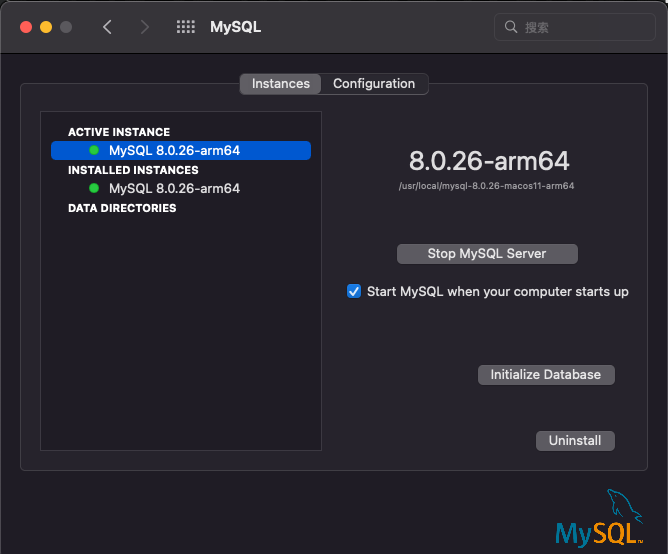
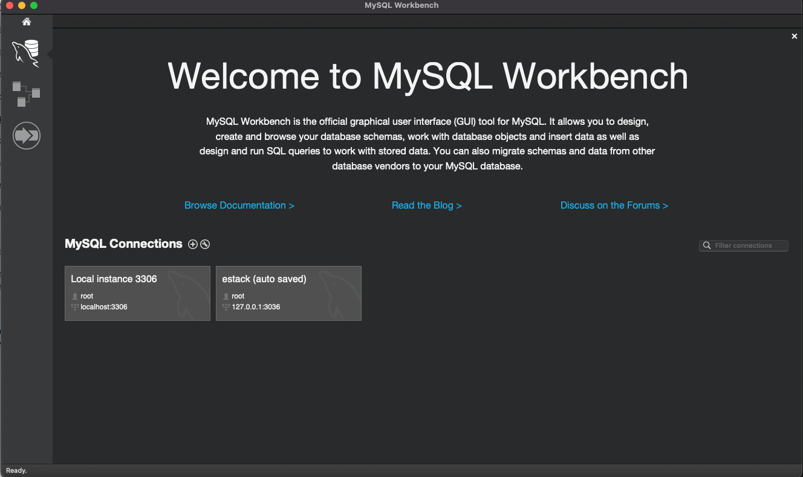
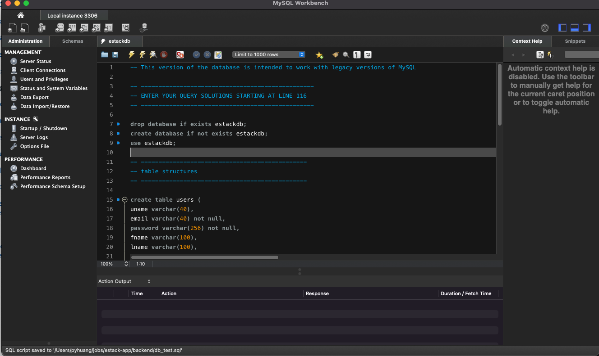

# MySQL setup
## Install
- When using Mac OS X, you should install MySQL Community Server (the database) and MySQL Workbench (the development environment)
- When using Windows, you should be able to use MySQL on Windows (Install & Tools, or MySQL Installer for Windows) to download and install the Community Server (database) and Workbench (development environment) at the same time 
## Setup
1. Go to [user.js](../../routes/users.js) to obtain relevant database information.
2. Setup your local MySQL server
   1. Initialize database using the information
   2. Start MySQL Server
   
3. Open the local instance in MySQL Workbench
    
4. Open [estackdb.sql](../../mysql/estackdb.sql) in this local instance
    
5. Click the flash icon to create database
