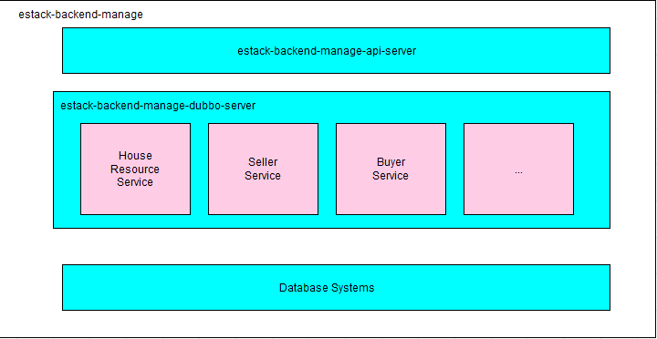
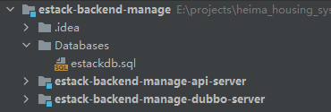

# Estack - Backend
## Project Structure 

Note: The api server is accessible by the frontend part.

Project Directory:

## Setup
1. Install Jetbrains IntelliJ IDEA and Java.
2. Install docker.
### Set up Database
1. `docker pull percona:latest`
2. `docker create --name percona -v <host directory>:/var/lib/mysql -p 3306:3306 -e MYSQL_ROOT_PASSWORD=root percona:latest`
   1. -v: mount the host directory to `/var/lib/mysql` in the docker container
3. `docker start percona`
    1. The docker for database starts now.
4. please remember the address and port of the sql docker and use them to replace the corresponding placeholders in the project 
   1. (I'll label those placeholders using comments like "sql address/port")

### Set up Dubbo and ZooKeeper
Apache Dubbo is a distributed service framework.
ZoomKeeper is a popular registry tool used in Apache Dubbo.
#### Set up ZooKeeper using Docker
```
docker pull zookeeper:3.5
docker create --name zk -p 2181:2181 zookeeper:3.5 
docker start zk
```
Please remember the address and port of the ZooKeeper docker and use them to replace the corresponding placeholders in the project.

I'll label them using comments like "ZooKeeper address/sql"
